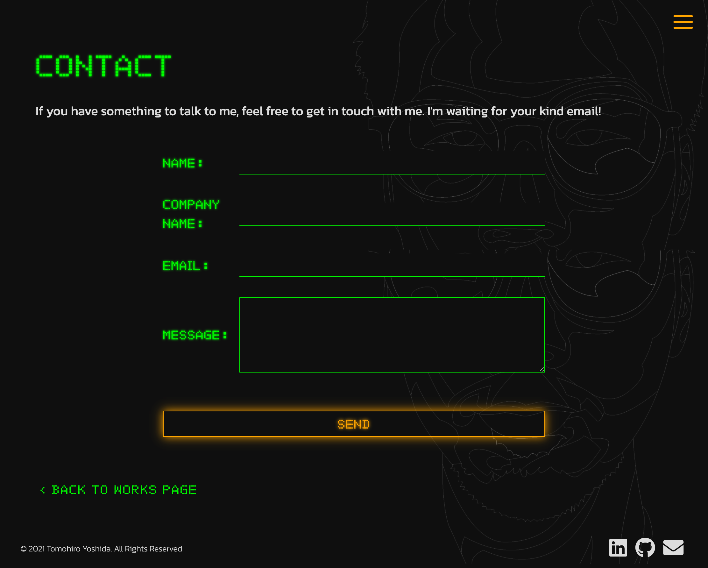

# portfolio-site

## About
This is the portfolio site to showcase my works and skills.

To see this website, please visit https://tomohiroyoshida.com.

## Why I (our team) created this web application
I created the website to understand how to develop website with vanilla JavaScript and related techniques.

I can create a website with conventional technology. 
(I have used React to develop websites in other projects. If you would like to see other projects, please vists my works page, https://tomohiroyoshida.com/works.html, and take a look at my other works.)

## Technology
The technology listed below is used to create this website.

* Contentful(Headless CMS)
* JavaScript & jQuery
* SASS
* CSS3
* Webpack

### Headless CMS

I adopt Contentful (https://www.contentful.com) to manage contents of this website.

### CSS3
I added animations to the page transition and some other actions visitors made to make the website more attractive for visitors.

### Webpack
I configured the webpack file to bundle JavaScript file.

### Others
#### Mailer
I have created a server-side functionality for contact form. When a visitor submits a form, the automated message is sent to the visitor's email address while the message inputed by the visitor is sent to my email address.

https://tomohiroyoshida.com/contact.html

